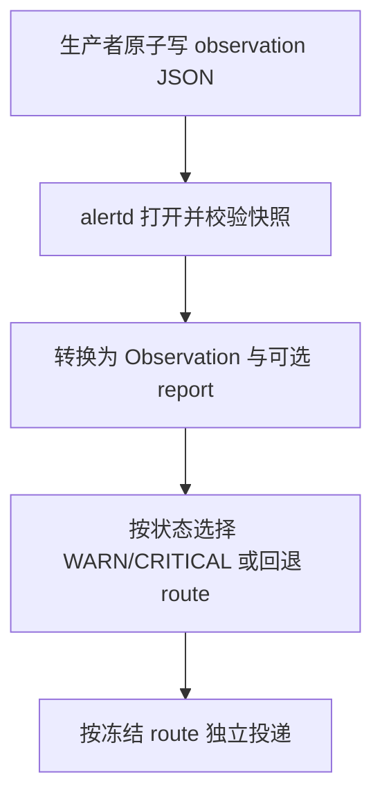

# 外部观察协议与投递路由契约

## 结论摘要

`observation_file` 让业务程序通过原子 JSON 快照提交当前状态；alertd 只验证快照、新鲜度、告警状态机和投递。每条已入队消息冻结目标 route，route 的投递失败不得阻塞其他 route。

## 输入输出

| 类别 | 项目 | 形态 | 语义 |
|---|---|---|---|
| 输入 | observation 快照 | 最大 64 KiB JSON 文件 | 原子替换；状态为 `ok`、`warn` 或 `critical` |
| 输入 | delivery route | `default` 或已配置名称 | `delivery_route` 是报告与未分级告警的回退目标；可选 WARN/CRITICAL route 分别接收对应等级的告警与恢复 |
| 输入 | notification presentation | 可选标题和详情 key 列表 | 仅控制告警文本标题及显示哪些 producer detail；不改变快照、状态机或 route |
| 成功输出 | AlertEvent | 既有告警事件 | 快照状态进入既有状态机 |
| 成功输出 | 专项报告 | 持久队列消息 | 新 report ID 仅在成功入队后确认 |
| 降级输出 | stale/missing | configured severity | 快照不可用属于被监控对象异常 |
| 失败输出 | protocol invalid | CollectError | 连续失败后形成采集盲区 |

## 不变量

- 同一 spool 共享容量，但每个 route 独立 FIFO、客户端与退避。
- route 在消息入队时写入队列文件；热加载不得重定向已入队消息。
- `warn_delivery_route` 与 `critical_delivery_route` 只影响告警生命周期；`forward_report` 始终走 `delivery_route`。
- `warn_notification_label`、`critical_notification_label` 可替换对应严重级别的通知标题；未配置时保留 `WARN`、`CRITICAL`。
- `notification_include_summary` 为 `bool`，默认 `true`；设为 `false` 时省略通用“状态”行，供 detail 已完整表达当前事实的观察器使用。
- 空 `notification_detail_keys` 保留既有全部详情；非空时按配置顺序只显示存在且非内部的 detail key。
- `notification_detail_body_key` 为可选 detail key，默认未设置；设置后 alertd 原样渲染该 key 的值而不附加字段标题。它只控制呈现，不解析 producer 的业务字段或改变告警状态机。
- P1/CRITICAL 降为 P2/WARN 时，先向原 CRITICAL route 发送恢复，再从新的 WARN 观察重新开始防抖；alertd 不把它伪装成全量恢复。
- 内部事件和日报固定走 `default`；非 default route 故障经 `default` 报告。
- 旧队列消息没有 route 时视为 `default`，不得丢弃或改投其他 route。
- 只有快照文件 mtime 决定新鲜度；业务状态的新鲜度由生产者在快照中判断。

## 主流程

## 错误处置

| 发生点 | 触发条件 | 可恢复性 | 处理动作 | 重试边界 | 对外结果 |
|---|---|---|---|---|---|
| S1 | 生产者写入失败 | 可恢复 | 保留上个原子文件 | 文件过期前 | 旧状态继续可读 |
| S2 | JSON、字段或大小非法 | 可恢复 | 拒绝整个快照 | 下个采样周期 | collector failure |
| S3 | report 入队失败 | 可恢复 | 不更新已确认 report ID | 下个采样周期 | report 重试 |
| S5 | route 投递失败 | 可恢复 | 该 route 指数退避 | 独立于其他 route | default 收到 route 健康事件 |

## 验收场景

- 给定 `live-mm` route 失败，当 default 有消息时，则 default 仍可投递。
- 给定相同 report ID，当 daemon 重启后，则不重复发送。
- 给定快照被原子替换，当采集时，则 metadata 与内容来自同一已打开文件。
- 给定损坏快照连续达到阈值，当采集时，则产生采集盲区而非业务状态告警。
