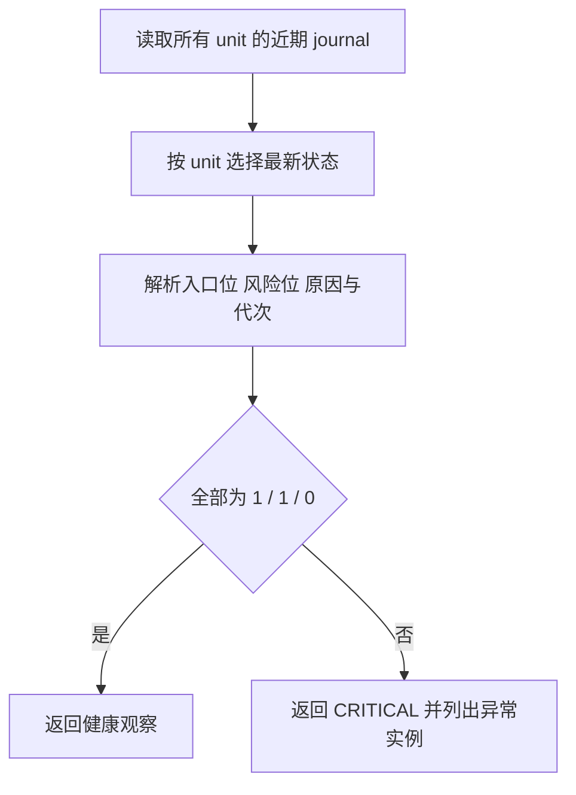

# live_mm 交易入口监控契约

## 结论摘要

该检查只读监控多个 live_mm unit 的周期状态。任何实例的人工入口关闭、有效入口关闭、运行时风险位非零、状态缺失、过期或格式损坏均视为 CRITICAL；检查绝不修改交易状态。

## 输入输出

| 类别 | 项目 | 形态 | 语义与约束 |
|---|---|---|---|
| 输入 | 实例映射 | `[{name, unit}]` | 1–64 个唯一名称和唯一 systemd unit |
| 输入 | 最新状态 | journald JSON | 必须包含 unit、时间戳及结构化状态字段 |
| 成功输出 | 健康观察 | `Observation::Healthy` | 所有实例均为 operator=1、entries=1、risk=0 |
| 失败输出 | 业务异常 | `Observation::Unhealthy(Critical)` | 至少一个实例状态不满足健康条件 |
| 失败输出 | 采集失败 | `CollectError` | journalctl 本身不可执行、超时或输出不是合法 JSON |

## 不变量与副作用边界

- 一次采集只启动一个 `journalctl`，同时覆盖所有配置实例。
- 同一 unit 只采用时间戳最新的状态行。
- 监控只读 journald；不得开启交易、清除风险、发送信号或重启服务。
- 无签名钉钉模式只改变请求 URL，不改变默认签名模式。

## 快乐路径

## 错误处置

| 发生点 | 触发条件 | 可恢复性 | 处理动作 | 重试边界 | 副作用清理 | 对外结果 |
|---|---|---|---|---|---|---|
| S1 | journalctl 失败或超时 | 可恢复 | 返回采集错误，由 alertd 周期重试 | 下一采样周期 | 无 | 采集盲区状态 |
| S2 | unit 无近期状态 | 可恢复 | 将对应实例标为异常 | 下一采样周期 | 无 | CRITICAL |
| S3 | 字段缺失或非法 | 可恢复 | 将对应实例标为异常并报告字段 | 下一采样周期 | 无 | CRITICAL |
| S4 | 任一位不满足健康合同 | 可恢复 | 报告实际位值，等待自然恢复 | 下一采样周期 | 无 | CRITICAL |

## 验收场景

- 给定四个实例均持续输出健康位，当采集时，则检查健康。
- 给定任一风险位非零或入口位为零，当异常持续到告警门限，则只发送告警、不修改交易。
- 给定状态过期、缺失或损坏，当采集时，则明确报告监控盲区。
- 给定状态重新连续健康达到恢复门限，则发送恢复通知。
- 给定 `delivery.signed=false`，发送时 URL 不含 `timestamp` 和 `sign`。
