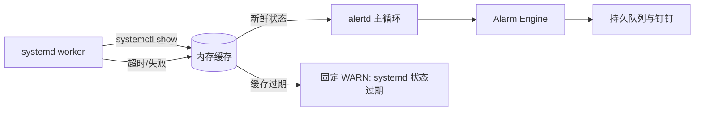

# systemd 后台探测与缓存行为契约

## 目的

`systemd` check 的 `systemctl show` 查询在后台 worker 执行。监控主循环只读取内存缓存，因此缓慢的 systemd/D-Bus 管理面不得阻塞进程、SHM、journal、投递或 watchdog。

## 配置输入

| 字段 | 类型 | 默认值 | 有效范围 | 来源 |
| --- | --- | --- | --- | --- |
| `runtime.systemd_probe_interval` | duration | `30s` | 5s–1h | TOML |
| `runtime.systemd_stale_after` | duration | `90s` | probe interval–24h | TOML |
| `checks[].probe_interval` | optional duration | 继承全局 | 5s–1h | TOML |
| `checks[].stale_after` | optional duration | 继承全局 | effective probe interval–24h | TOML |

它们是主机管理面负载与业务容忍时间的部署差异，因此外置；`runtime.command_timeout` 继续限制一次 `systemctl` 命令，且不支持热加载。

## 状态与不变量

- 每个 enabled `systemd` check 最多一个 worker，单个 check 的 probe 不重叠。
- 主循环不得直接执行 `systemctl`。
- 最后一次成功状态在 `stale_after` 内仍可用于服务状态判断；之后的 probe 失败仅作为日报/local log 中的 `degraded` 详情，不单独通知。
- 缓存过期或启动后超过 `stale_after` 仍没有成功快照时，仅触发 `<check>/collector` 的固定 WARN 盲区告警；不得伪装成 unit inactive。
- 明确返回 inactive、failed 或未 loaded 时，沿用 check 的 severity 产生服务告警。
- 缓存不落入 `state.json`；重启后必须重新获取可信快照。
- 停止、禁用或移除 worker 时取消其 `systemctl` 进程组并有界 join，不能等待完整 command timeout。

## 关键场景

| 条件 | 服务告警 | collector 告警 | 日报 |
| --- | --- | --- | --- |
| 成功且全部 active | 正常 | 正常 | 正常数量 |
| 成功且 unit inactive | 按 check severity | 正常 | 异常服务 |
| probe 失败但缓存新鲜 | 使用最后成功服务状态 | 不告警 | degraded、缓存年龄与错误 |
| 无成功缓存或缓存过期 | 不判断服务状态 | 固定 WARN | 状态过期/盲区 |
| 新 probe 成功 | 使用新状态 | 进入既有恢复防抖 | 清除 degraded |
| `runtime.enabled=false` | 不采集 | 不采集 | 不生成日报 |

## 验收

- 配置校验覆盖全局默认、check 覆盖、范围与热加载回退。
- 阻塞 probe 时，其它 collector、投递和 watchdog 仍按周期运行。
- probe 失败、缓存过期、明确 inactive 和恢复分别产生上述表格规定的可观察结果。
- worker 移除、全局关闭和正常退出都会取消子进程，且不会信任旧缓存。
