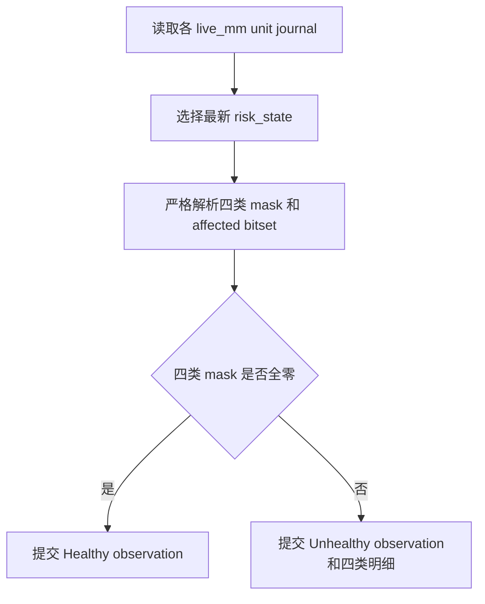

# live_mm 四层风险监控行为契约

## 结论摘要

`live_mm_entry` 同时监控 `runtime_risk_mask`、`symbol_risk_combined_mask`、`order_guard_account_mask` 和 `order_guard_symbol_combined_mask`。这是交易入口监控，错误遗漏会隐藏真实风险，因此采用严格行为契约。

## 输入输出

| 类别 | 项目 | 形态 | 语义 |
|---|---|---|---|
| 输入 | `event=risk_state` | journald结构化行 | 同一时刻四类当前 mask 及两类受影响 symbol bitset |
| 输入 | `stale_after` | duration | journal读取窗口；窗口内无快照等价于状态缺失 |
| 成功输出 | Healthy | observation | 四类 mask 均为零且风险快照存在 |
| 失败输出 | Unhealthy | configured severity | 任一 mask 非零、字段损坏或快照缺失 |

## 不变量与副作用边界

1. 只使用最新完整 `risk_state`，不把历史 BLOCK 事件当作当前风险。
2. 四类 mask 分开展示，不互相折叠；受影响 symbol bitset 必须保留。
3. alertd 只观测和通知，不开启入口、不清除风险、不重启服务。
4. order guard 非零仍沿用检查配置的 severity，但消息必须保留 guard 字段，使值班人员能识别“仅暂停 Open”的语义。
5. 快照恢复为全零后，恢复通知仍由 alertd 既有 `recover_for` 状态机控制。

## 主流程

## 错误处置

| 发生点 | 触发条件 | 可恢复性 | 处理动作 | 重试或降级边界 | 副作用清理 | 对外结果 |
|---|---|---|---|---|---|---|
| S1 | journal读取失败 | 可恢复 | 交给既有采集失败计数 | `collect_fail_after_n` | 无 | 达阈值后告警 |
| S2 | 活跃unit没有风险快照 | 可恢复 | 标记监控盲区 | 下个采样周期重新读取 | 无 | Unhealthy |
| S3 | 任一必填字段损坏 | 可恢复 | 拒绝该快照 | 不猜测默认值 | 无 | Unhealthy |
| S4 | 任一 mask 非零 | 可恢复 | 保留原值与affected bitset | 等待当前状态恢复 | 无 | Unhealthy |

## 验收场景

- 给定四类 mask 全零，则检查健康。
- 给定任意一类 mask 非零，则检查异常并在实例明细中显示原始十六进制值。
- 给定 `risk_state` 缺失或字段损坏，则检查异常，不能退化为只检查 `runtime_risk_mask`。
- 给定后续快照全部恢复为零，则进入既有恢复确认流程。
