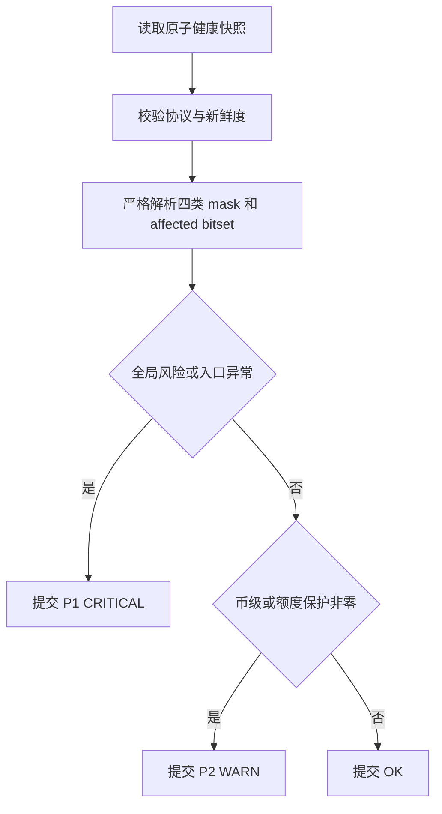

# live_mm 四层风险监控行为契约

## 结论摘要

`observation_file` 读取 live_mm 外部观察器原子发布的健康快照。快照同时覆盖 `runtime_risk_mask`、`symbol_risk_combined_mask`、`order_guard_account_mask` 和 `order_guard_symbol_combined_mask`；alertd 不再直接读取 live_mm journal 或调用 systemctl。

## 输入输出

| 类别 | 项目 | 形态 | 语义 |
|---|---|---|---|
| 输入 | 外部健康快照 | 原子 JSON 文件 | 观察器从 live_mm 结构化日志和 systemd 状态归约出的当前状态 |
| 输入 | `stale_after` | duration | 快照 `observed_at` 或文件元数据超过门限等价于状态缺失 |
| 成功输出 | Healthy | observation | 四类 mask 均为零且风险快照存在 |
| 失败输出 | P2 / WARN | observation | 币级风险或账户/币级额度保护非零；仅阻止受影响范围的新增开仓，退出链路保持可用 |
| 失败输出 | P1 / CRITICAL | observation | 全局风险、入口异常、风险快照缺失/损坏或服务停止 |

## 不变量与副作用边界

1. 只使用最新完整快照，不把历史 BLOCK 事件当作当前风险。
2. 四类 mask 分开展示，不互相折叠；受影响 symbol bitset 必须保留。
3. alertd 只观测和通知，不开启入口、不清除风险、不重启服务。
4. `runtime_risk_mask` 非零固定为 P1；`symbol_risk_combined_mask`、`order_guard_account_mask` 与 `order_guard_symbol_combined_mask` 非零固定为 P2。没有按持续时间、币种数量或影响比例自动升级的规则。
5. order guard 非零消息必须保留 guard 字段，使值班人员能识别“仅暂停 Open”的语义。
6. P1 降为 P2 时，一级 route 先收到恢复，二级 route 对持续的 P2 风险重新执行自己的防抖；全零恢复仍由既有 `recover_for` 控制。

## 主流程

## 错误处置

| 发生点 | 触发条件 | 可恢复性 | 处理动作 | 重试或降级边界 | 副作用清理 | 对外结果 |
|---|---|---|---|---|---|---|
| S1 | 快照文件缺失、不可读或 JSON 不合法 | 可恢复 | 交给既有采集失败计数 | `collect_fail_after_n` | 无 | 达阈值后告警 |
| S2 | 快照过期 | 可恢复 | 标记监控盲区 | 下个采样周期重新读取 | 无 | Unhealthy |
| S3 | 任一必填字段损坏 | 可恢复 | 拒绝该快照 | 不猜测默认值 | 无 | Unhealthy |
| S4 | 全局 mask 非零、入口异常或风险快照不可用 | 可恢复 | 保留原值与 affected bitset | 等待当前状态恢复 | 无 | P1 / CRITICAL |
| S6 | 币级或额度保护 mask 非零 | 可恢复 | 保留原值与 affected bitset | 等待当前状态恢复；不升级 P1 | 无 | P2 / WARN |

## 验收场景

- 给定四类 mask 全零，则检查健康。
- 给定 `runtime_risk_mask` 非零，则为 P1；给定任一其余三类 mask 非零，则为 P2，并在实例明细中显示原始十六进制值。
- 给定 `risk_state` 缺失或字段损坏，则检查异常，不能退化为只检查 `runtime_risk_mask`。
- 给定后续快照全部恢复为零，则进入既有恢复确认流程。
